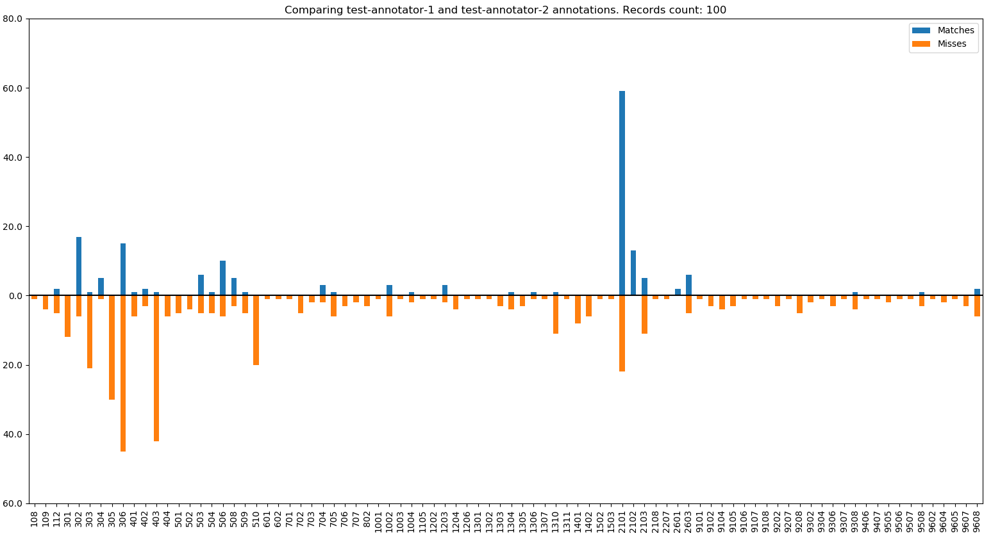

# Ecganncompare

The program is used to compare annotation files obtained as a result of processing a set of ECG records. 
Annotation to databases are available on [ecg.ru](https://ecg.ru/).

## Resources

Professional tool for physicians and biomedical engineers  
https://ecg.ru/

## Usage

Python (2.6 or later) must be installed on the user's computer to run the program.
The program accepts two JSON annotation files. The format of the input files will be described below.
The launch is carried out through the command line.
Two arguments must be passed to the file ecganncmp.py as follows

    python ecganncmp.py ref_filename test_filename

- `ref_filename` is a path to file wiht reference annotations,
- `test_filename` is a path to file with annotations, that need to be compare with reference.

As a result of the program's work, a report is generated in JSON format.
The report format will be described below.
By default, the report is output to the console window.
To output the report to a file, the `ecganncmp` program must be run as follows (in Windows OS)

    python ecganncmp.py ref_filename test_filename > output_filename

- `output_filename` is a path to file that will be contain report of annotation comparing.

## Documentation an usage

See the input and output [`format description`](./formats.md).

## Comparing result usage example

To demonstrate the use of comparison results, the program `histogram_demo` was developed.
This program uses the [`matplotlib`](https://matplotlib.org/) and [`pandas`](https://pandas.pydata.org/) packages, which are not included in the standard Python library. 
To install them, you need to run the following command

    pip install matplotlib pandas

The program reads the `ecganncmp` result and makes 4 histograms. The histograms show distributions of
- annotations in the reference file,
- annotations in the test file,
- matched annotations,
- missed and excess annotations.

To run the program, run the following command

    python histogram_demo.py cmp_result

- `cmp_result` is a path to the `ecganncmp` output file that contains a results of comparison.

Results of `histogram_demo` shown on the following images.  

- The top histogram shows the distribution of reference annotations.
- The bottom histogram shows the distribution of test annotations.

- The top histogram shows the distribution of matched annotations.
- The bottom histogram shows the distribution of missed and excess annotations.
