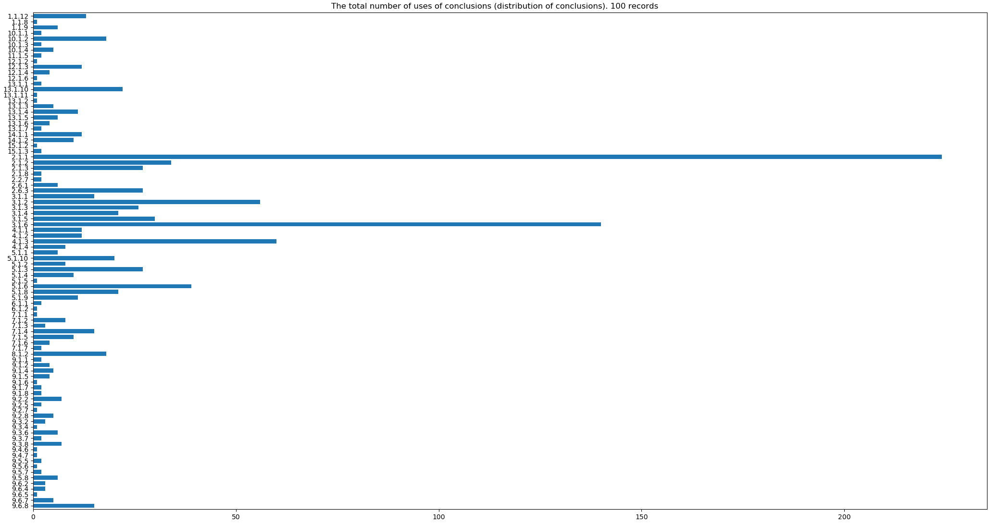
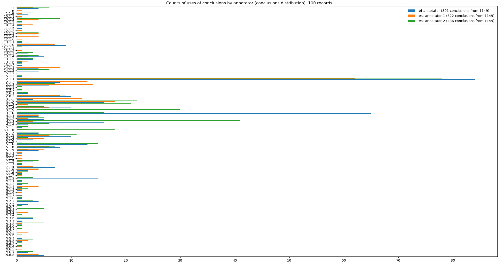
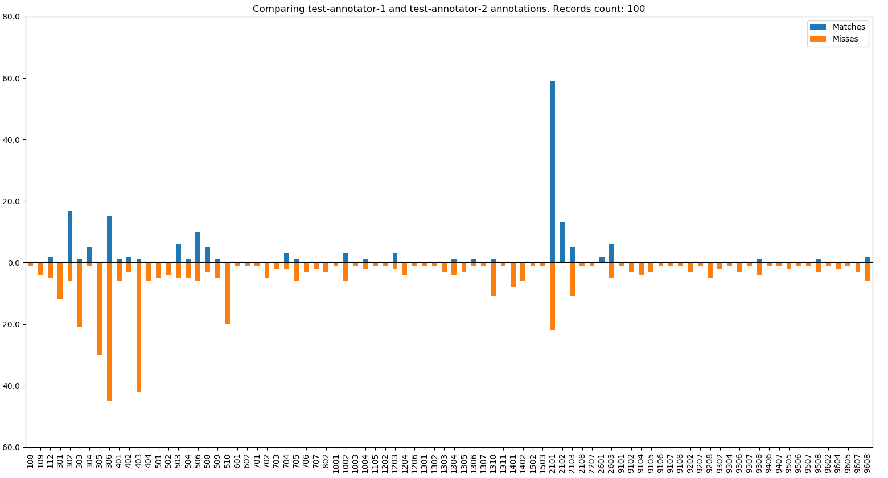
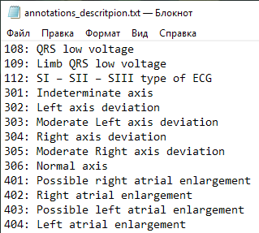

# Comparing result usage example

To demonstrate the use of comparison results, the programs `anndistribution` and `cmphistogram` was developed.
These programs uses `ecganncmp` module and packages [`matplotlib`](https://matplotlib.org/) and [`pandas`](https://pandas.pydata.org/).
The last two are not included in the standard Python library. 
To install them, you need to run the following command

    pip install matplotlib pandas

## AnnDistribution

The program [`anndistribution`](../utils/anndistribution.py) reads folders with annotation files. 
Data is grouped by thesaurus. The largest group is selected for display, the rest are ignored.
The program makes a histogram containing the distribution of conclusions for each annotator, and also makes a common histogram, without dividing by annotators.

To run the program, run the following command

    python anndistribution.py folder_path1 folder_path2

- `folder_path1` and `folder_path2` is a paths to folders with annotation files.
- more folder paths can be passed.

Results of `anndistribution` shown on the following images.  

- The graph legend contains the name of the annotator and the corresponding color of the bars.

The program `cmphistogram` reads the `ecganncmp` result and makes histogram that contains distributions of annotations matches and misses.

To run the program, run the following command

    python cmphistogram.py cmp_result1 cmp_result2

- `cmp_result1` and `cmp_result2` are paths to files with `ecganncmp` result
- more filepaths can be passed.

Results of `cmphistogram` shown on the following image.

- The graph legend describe colors of the bars (matches and misses).

Both programs can be run without parameters, then the input data search will be performed in the folder `data` in the current folder.

Also both parameters can be run with parameter `--thesaurus` as follows

    python utility_name.py input_path --thesaurus=path_to_thesaurus

- `path_to_thesaurus` is a path to thesaurus file

In this case, along with histograms, text values corresponding to annotations will be displayed on the screen, as shown in the screenshot below.

