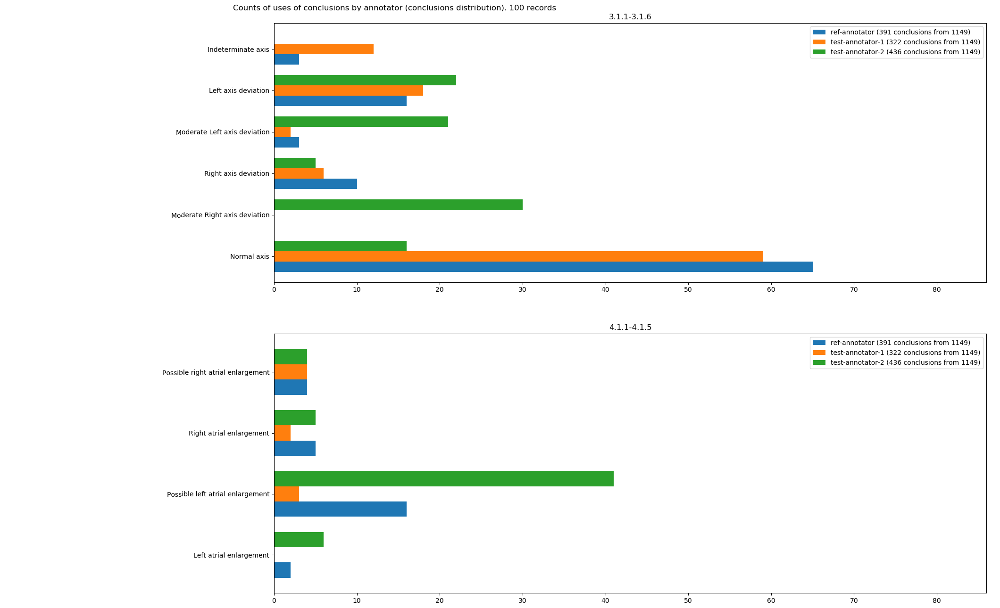
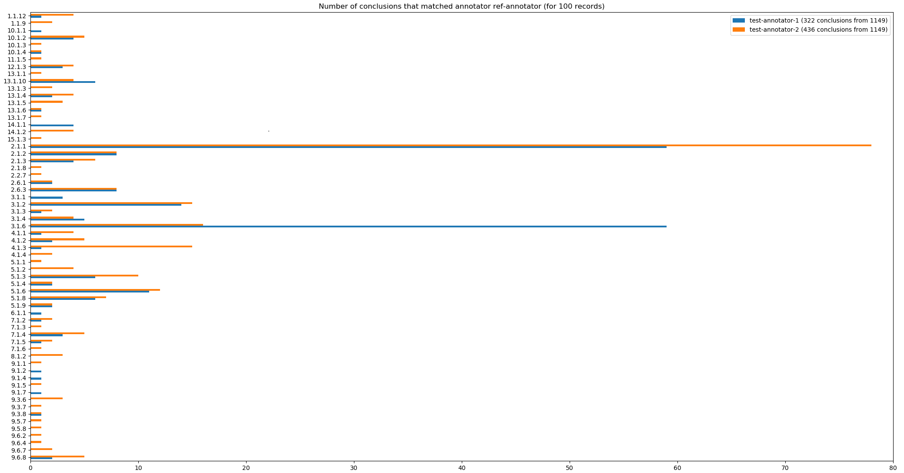
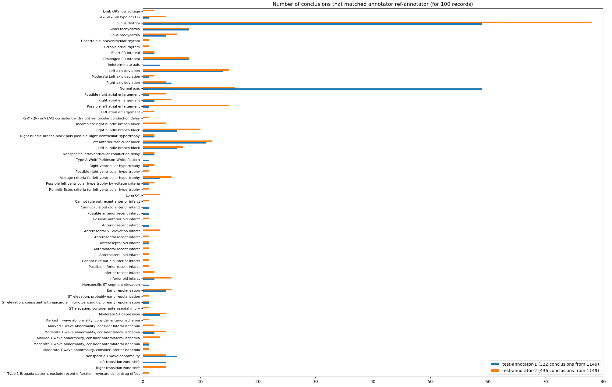

# Comparing result usage example

To demonstrate the use of comparison results, the programs `anndistribution` and `cmphistogram` was developed.
These programs uses `ecganncmp` module and packages [`matplotlib`](https://matplotlib.org/) and [`pandas`](https://pandas.pydata.org/).
The last two are not included in the standard Python library. 
To install them, you need to run the following command

    pip install matplotlib pandas

## AnnDistribution

The program [`anndistribution`](../utils/anndistribution.py) reads folders with annotation files. 
Data is grouped by thesaurus. The largest group is selected for display, the rest are ignored.
The program makes a histogram containing the distribution of conclusions for each annotator, and also makes a common histogram, without dividing by annotators.

To run the program, run the following command

    python anndistribution.py folder_path1 folder_path2

- `folder_path1` and `folder_path2` is a paths to folders with annotation files;
- one or more folder paths can be passed;
- paths of input folders may not be specified, then the program will try to find input files in the `data` folder, if it is in the same folder with the program file.

Results of `anndistribution` shown on the following images.  


- The graph legend contains the name of the annotator and the corresponding color of the bars.

Program `anndistribution` has an optional command line argument `thesaurus` that allows you to specify the path to the thesaurus file. 
If you specified a thesaurus file, the text values of conclusion codes will be displayed on the histogram, the bars will be grouped and ordered.

To use it, run the program as follows

    python anndistribution.py --thesaurus=path_to_thesaurus input_folder_path

- `path_to_thesaurus` is a path to thesaurus file. Thesaurus format is described in [`formats.md`](./formats.md);
- `input_folder_path` using has been described above.

Results of using `anndistribution` with `thesaurus` argument shown on the following images.



    

## CmpHistogram

The program [`cmphistogram`](../utils/cmphistogram.py) reads the `ecganncmp` results or folders with annotation files. 
Data is grouped by thesaurus. The largest group is selected for processing, the rest are ignored.
For each annotator in the dataset, the program makes a histogram that contains the distributions of the conclusions matches of the other annotators with the selected annotator.  
_For better view, the program compares **no more than five** annotators._

To run the program, run the following command

    python cmphistogram.py input_path1 input_path2

- `input_path1` and `input_path1` are paths to file with `ecganncmp` result or to folder annotation files;
- one or more paths can be passed;
- if input paths not passed, `cmphistogram` try to find input data jast like a `anndistribution`.

Results of `cmphistogram` shown on the following image.



- The graph legend describe colors of the bars: annotator name and conclusion numbers.

Program `cmphistogram` has an optional command line argument `thesaurus` that allows you to specify the path to the thesaurus file.
If you specified a thesaurus file, the text values of conclusion codes will be displayed on the histogram and the bars will be ordered.

To use it, run the program as follows

    python cmphistogram.py --thesaurus=path_to_thesaurus input_folder_path

- `path_to_thesaurus` is a path to thesaurus file. Thesaurus format is described in [`formats.md`](./formats.md);
- `input_folder_path` using has been described above.

Results of using `cmphistogram` with `thesaurus` argument shown on the following images.



## CmpTablesUtil

The program [`cmptablesutil`](../utils/cmptablesutil.py) reads folders with annotation files. 
Data is grouped by thesaurus. The largest group is selected for processing, the rest are ignored.
The program creates two files: 
  - excel-table with following annotators comparing statistics:
    - sensitivity,
    - specfificity,
    - PPV,
    - PNV,
    - accuracy,
    - records number.
  - JSON file containing, for each conclusion, a list of annotators that used it.

To run the program, run the following command

    python cmptablesutil.py folder_path1 folder_path2

- `folder_path1` and `folder_path2` is a paths to folders with annotation files;
- one or more folder paths can be passed;
- paths of input folders may not be specified, then the program will try to find input files in the `data` folder, if it is in the same folder with the program file.

Program `cmptablesutil` has an optional command line argument `thesaurus` that allows you to specify the path to the thesaurus file. 
If you specified a thesaurus file, the aggregates will be more accurate and the items in the annotator file will also be ordered.

To use it, run the program as follows

    python cmptablesutil.py --thesaurus=path_to_thesaurus input_folder_path

- `path_to_thesaurus` is a path to thesaurus file. Thesaurus format is described in [`formats.md`](./formats.md);
- `input_folder_path` using has been described above.

Following listing shows `cmptablesutil` result file.

```json
{
    "annotators": [
        "ref-annotator", 
        "test-annotator-1", 
        "test-annotator-2"
    ], 
    "thesaurus": "MCS", 
    "records": [
        {
            "database": "CSE Common Standards for ECG", 
            "record": "MA1_005", 
            "conclusionsAnnotators": {
                "2.1.2": [
                    "ref-annotator", 
                    "test-annotator-1", 
                    "test-annotator-2"
                ], 
                "3.1.4": [
                    "ref-annotator", 
                    "test-annotator-1", 
                    "test-annotator-2"
                ], 
                "4.1.1": [
                    "test-annotator-1"
                ], 
                "4.1.2": [
                    "ref-annotator", 
                    "test-annotator-2"
                ], 
                "9.1.8": [
                    "test-annotator-2"
                ]
            }
        }, 
        {
            "database": "CSE Common Standards for ECG", 
            "record": "MA1_004", 
            "conclusionsAnnotators": {
                "2.1.1": [
                    "ref-annotator", 
                    "test-annotator-1", 
                    "test-annotator-2"
                ], 
                "3.1.5": [
                    "test-annotator-2"
                ], 
                "3.1.6": [
                    "ref-annotator", 
                    "test-annotator-1"
                ]
            }
        }
    ]
}
```

## FilterAnn

The program [`filterann`](../utils/filterann.py) recieve paths to annotation files or to folders with its.  
The program select annotation files by specified conditions.

To run the program, run the following command

    python filterann.py input_path1 input_path2 --settings=path_to_settings_file --output_dir=path_to_results

- `input_path1` and `input_path1` are paths to annotation files or to folders with its;
- one or more paths can be passed;
- if input paths not passed, `filterann` try to find input data jast like a `anndistribution`;
- `path_to_settings_file` is path to JSON-file for filter settings, file format is described in [`formats.md`](./formats.md);
- `path_to_results` is path to the directory where files that meet the specified conditions will be copied (if not specified, files wil be copied to derectory `filterann_result`).

If you used criteria `group` for files selection, thesaurus file should be specified by optional command line argument `thesaurus` as follows

    python filterann.py --thesaurus=path_to_thesaurus <other_arguments...>

- `path_to_thesaurus` is a path to thesaurus file. Thesaurus format is described in [`formats.md`](./formats.md);
- `other_arguments` is implies other command line arguments that has been described above (don't need angle brackets for real using).

## PrintStats

Utility [`printstats`](../utils/printstats.py) reads folders with annotation files.
It print summary about input annotation files.  

_Note: program output will be fully translated into English in a future version_

To run the program, run the following command

    python printstats.py input_path1 input_path2

- `input_path1` and `input_path1` are paths to folders with annotation files;
- one or more paths can be passed;
- if input paths not passed, `filterann` try to find input data jast like a `anndistribution`.

Following listing shows part of `printstats` output:

```
Число записей: 101
Число поставленных заключений: 1151

Счетчики использования заключений (всего использовано 90): 
  3.1.3: 26
  3.1.2: 56
  3.1.1: 15
  6.1.2: 1
  3.1.6: 140
  3.1.5: 30
  ...

Поставленные заключения:
ref-annotator
  CSE Common Standards for ECG, MA1_005: 2.1.2, 3.1.4, 4.1.2.
  CSE Common Standards for ECG, MA1_004: 2.1.1, 3.1.6.
  CSE Common Standards for ECG, MA1_007: 2.1.1, 3.1.6, 7.1.5.
  ...
```

Program `printstats` has an optional command line argument `thesaurus` that allows you to specify the path to the thesaurus file. 
If you specified a thesaurus file, the text values of conclusion codes will be displayed and items will be ordered.

To use it, run the program as follows

    python printstats.py --thesaurus=path_to_thesaurus input_folder_path

- `path_to_thesaurus` is a path to thesaurus file. Thesaurus format is described in [`formats.md`](./formats.md);
- `input_folder_path` using has been described above.

Following listing shows part of `printstats` output with thesaurus specified:

```
Число записей: 101
Число поставленных заключений: 1151

Счетчики использования заключений (всего использовано 88): 
  1.1.8: 1
  1.1.9: 6
  1.1.12: 13
  2.1.1: 224
  2.1.2: 34
  2.1.3: 27
  ...

Поставленные заключения:
ref-annotator
  CSE Common Standards for ECG, MA1_005: 
    Sinus tachycardia,
    Right axis deviation,
    Right atrial enlargement.
  CSE Common Standards for ECG, MA1_004: 
    Sinus rhythm,
    Normal axis.
  CSE Common Standards for ECG, MA1_007: 
    Sinus rhythm,
    Normal axis,
    Possible left ventricular hypertrophy by voltage criteria.
  ...
```
