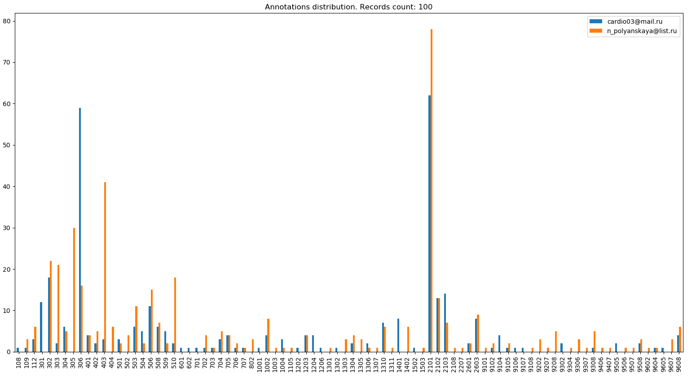
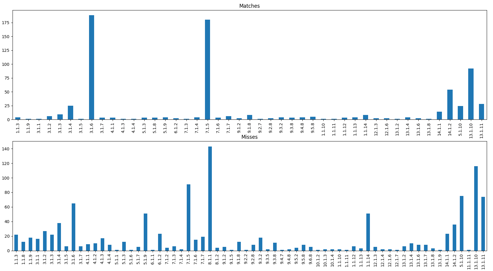

# Comparing result usage example

To demonstrate the use of comparison results, the programs `anndistribution` and `cmphistogram` was developed.
These programs uses `ecganncmp` module and packages [`matplotlib`](https://matplotlib.org/) and [`pandas`](https://pandas.pydata.org/).
The last two are not included in the standard Python library. 
To install them, you need to run the following command

    pip install matplotlib pandas

The program `anndistribution` reads the `ecganncmp` result and makes histogram that contains distributions of annotations in the reference and test sets.

To run the program, run the following command

    python anndistribution.py cmp_result

- `cmp_result` is a path to the `ecganncmp` output file that contains a results of comparison.

Results of `anndistribution` shown on the following image.  

- The graph legend contains the name of the annotator and the corresponding color of the bars.

The program `cmphistogram` reads the `ecganncmp` result and makes histogram that contains distributions of annotations matches and misses.

To run the program, run the following command (similar to `anndistribution`)

    python cmphistogram.py cmp_result

Results of `cmphistogram` shown on the following image.

- The graph legend describe colors of the bars (matches and misses).
